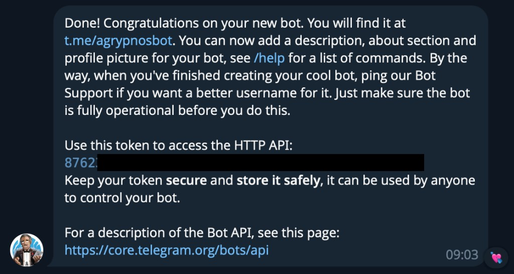
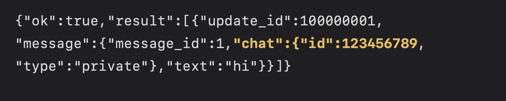
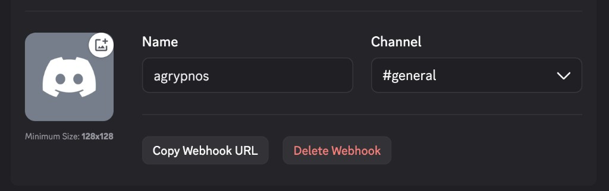
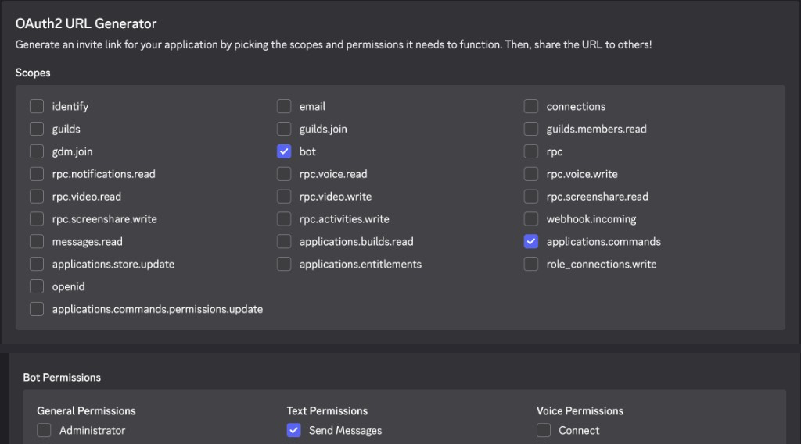

<div align="center">
  
  <h1>Agrypnos</h1>
  <p><b>Close the lid. Your coding agents keep working.</b></p>
  <p>A small macOS menu-bar app that keeps your Mac awake with the lid shut while your agents run, and lets it sleep again when they go idle or when you say so.</p>
  <p>
    <a href="https://github.com/VremennoiParadox/Agrypnos/actions/workflows/core.yml"></a>
    
    
    <a href="LICENSE"></a>
    
  </p>
</div>

<table align="center">
  <tr>
    <td align="center"><b>Watches</b></td>
    <td align="center" width="96"><br>Cursor</td>
    <td align="center" width="96"><br>Claude Code</td>
    <td align="center" width="96"><br>Codex</td>
    <td align="center" width="96"><br>OpenCode</td>
  </tr>
</table>

<p align="center"><i>Greek</i> agrypnos: <i>sleepless.</i></p>

---

## Why this exists

You start a long agent run, close the laptop, and walk away. macOS goes to sleep and the run dies with it.

The usual keep-awake tricks don't help here. Power assertions (what `caffeinate` uses) stop working the moment the lid closes. The one switch that does hold is `pmset disablesleep`, and it's easy to forget to turn off again. Agrypnos flips it for you, turns the screen down while the lid is shut, and flips it back once your agents have been idle for a while or you turn it off.

## What you get

- Turn on **Keep the watch** from the menu bar or with `⌥⌘A`. Nothing changes on screen until you close the lid.
- On lid close, the keyboard backlight goes off and the panel dims to a floor you choose. If you prefer, the panel sleeps instead.
- Set How long to **Agents** and the watch ends by itself once your agents have been idle for a few minutes.
- Low battery and thermal pressure end the watch too, and a reboot always clears it.
- If you want, *your* Telegram or Discord bot gets a message when the agents go idle, and takes `/arm`, `/disarm`, and `/status` from your phone.
- No analytics, no accounts, no shared bot. The only privileged piece is a two-command sudoers rule, spelled out in [SECURITY.md](SECURITY.md).

## Install

There's no signed download yet, so you build it yourself. You need macOS 14 or later and Xcode (or the Xcode command-line tools).

```bash
git clone https://github.com/VremennoiParadox/Agrypnos.git
cd Agrypnos
./Scripts/build-macos.sh
open dist/Agrypnos.app
```

An eye appears in the menu bar. That's Agrypnos. It has no Dock icon and no settings window. Everything lives in the menu-bar popover.

The first time you turn the watch on, Agrypnos asks to install a small sudoers rule so it can run exactly these two commands without a password:

```
/usr/bin/pmset -a disablesleep 1
/usr/bin/pmset -a disablesleep 0
```

macOS asks for your password once. To remove the rule later, run `./Scripts/ungrant.sh`.

## Quick start

1. Click the eye in the menu bar. The popover opens on **Watch**.
2. Under **How long**, pick **Agents**.
3. Turn on **Keep the watch**. The menu bar now says **Agents.**
4. Start your agent and close the lid.

Agrypnos waits until the lid has really closed (a single flicker of the lid sensor doesn't count), then turns the keyboard backlight off and dims the panel. When your agents have been idle for the idle wait (2 minutes by default), the watch turns off and the Mac is free to sleep.

Want it on until you say stop? Pick `∞` instead and turn it off yourself.

> [!NOTE]
> `1h`, `3h`, and custom minutes are remembered with the watch, but they don't turn it off on their own. Only **Agents** ends the watch by itself. Battery and thermal limits still apply to every option.

## How it works

### When the lid closes

The **Power** section has two panel modes. You pick one.

| Mode | On a confirmed lid close | When you open the lid again |
|---|---|---|
| **Dim panel** (default) | Brightness drops to your floor (15% by default, 1–40%). The panel stays on. | Brightness fades back over 1, 2, or 3 seconds (2 by default). |
| **Sleep panel** | The display itself sleeps (`displaysleepnow`). | The display wakes. No fade, so that setting is hidden. |

Both modes turn the keyboard backlight off. Neither one puts the Mac to sleep or turns the watch off, so your agents keep running either way. Turning the watch on with the lid open never touches the screen.

If Agrypnos never saw your brightness before the lid closed, it won't guess one when the lid opens. It leaves the screen alone.

### How it knows your agents are busy

It only looks at your own Mac. For each tool you leave checked under **Agents**, it watches two things: whether the tool's process is running, and whether its session files changed in the last 45 seconds. Claude Code and Codex also count CPU use.

| Tool | Session files it watches |
|---|---|
| Cursor | `~/.cursor/projects`, `~/.cursor/chats`, `~/.cursor/acp-sessions` |
| Claude Code | `~/.claude/projects` (or `$CLAUDE_CONFIG_DIR`) |
| Codex | `~/.codex/sessions` (or `$CODEX_HOME`) |
| OpenCode | `~/.local/share/opencode` (or `$XDG_DATA_HOME/opencode`) |

It reads file modification times, not what's inside the files.

Once it has seen work during this watch, it starts counting when the signals stop. If they stay quiet through the idle wait (2–15 minutes), the watch ends. If it never saw any work since you turned it on, it keeps the watch on. The idle wait exists because an agent can pause for a while between file writes, and that shouldn't look like the end of the run.

Agrypnos can't tell whether a model is "thinking". It only sees processes and files, so pick an idle wait that fits how your agents work.

> [!TIP]
> Terminal session files don't count as busy by default, so a chatty terminal can't hold the Mac awake forever. Turn on **Count terminal sessions as busy** in **Agents** if you want them to.

### When the watch turns itself off

- **Agents went idle.** Only when How long is **Agents**.
- **Low battery.** On battery, at the level you set (15% by default, 5–100%).
- **Thermal pressure.** When macOS reports serious or critical thermal state. You can turn this off in **Power**.
- **Low Power Mode.** On battery, a watch Agrypnos inherited from an earlier session ends. A watch you turned on yourself keeps going.
- **Reboot.** macOS clears the setting. Launch at login never turns the watch back on.
- **Quit or crash.** Quitting Agrypnos turns the setting off. If the app crashes or gets force-quit, a small helper it started at launch turns it off right after.

The **Watch** section shows when the last watch ended and why.

### Turning it off yourself

Click the toggle or press `⌥⌘A`. If the lid is open, the watch turns off and the Mac stays awake. If the lid is confirmed closed (say you're doing it from a bot or the hotkey on an external keyboard), the watch turns off and the Mac goes to sleep.

## Messages and remote commands

This part is optional and off by default. It lives in the **Notif** section. You bring your own bot. Agrypnos doesn't run one for you.

There are two separate pieces:

- **Idle message.** When **Agents** mode has seen work and then stayed idle through the wait, Agrypnos sends one message to your Discord webhook, your Telegram bot, or both. It doesn't send one when you turn the watch off, when a timer or battery limit ends it, or when it never saw any work.
- **Commands.** Send `/arm`, `/disarm`, `/status`, or `/help` to your own Telegram or Discord bot, and Agrypnos acts on them while the Mac is awake.

The app has the same steps as below, with screenshots. Click **Setup instructions…**, the first card in **Notif**.

### Commands

| Command | What happens |
|---|---|
| `/arm` | Turns on Keep the watch. |
| `/disarm` | Turns off Keep the watch. Lid open: the Mac stays awake. Lid confirmed closed: the Mac also goes to sleep. |
| `/status` | Replies with what Agrypnos knows right now: watch on or off, How long, lid state, agent activity, the last watch end, your safety settings, and battery (for example `Battery 62% · on AC`) when it can read it. |
| `/help` | Lists these commands. |

Agrypnos registers these four with your bot, so they show up in the `/` menu.

If the bot doesn't answer, the Mac is probably asleep. Nothing relays commands while it sleeps. Anything you sent in the meantime doesn't run when the Mac wakes up. The bot replies "Missed while asleep." instead, so a stale `/arm` can't surprise you hours later.

<details>
<summary><b>Telegram: create your bot</b></summary>

<br>

1. In Telegram, open [@BotFather](https://t.me/BotFather) and send `/newbot`. Pick a display name and a username that ends in `bot`.
2. BotFather replies with a token. Paste it into **Notif → Telegram → Token**. Treat it like a password.

   

3. Open your new bot and tap **Start** (or send it anything). Telegram only knows your chat id after you've messaged the bot.
4. In a browser, open `https://api.telegram.org/bot<token>/getUpdates` with your token in place of `<token>`. Find `"chat":{"id":` and copy the number after it. Close the tab when you're done, since the token stays in its history.

   

   If you see `"result":[]`, the bot hasn't seen a message yet. Message it again and reload. A private chat id is a positive number. A group id is usually negative.
5. Paste the number into **Notif → Telegram → Chat id**.
6. Turn on **Idle-after-wait POST** for the idle message, **Telegram inbound** for commands, or both.

Commands only count from the chat id you saved. If that's a group, anyone in the group can send them.

</details>

<details>
<summary><b>Discord: idle messages through a webhook</b></summary>

<br>

A webhook can only post into your channel. It can't receive commands. For those, set up the bot below.

1. In your server, go to **Server Settings → Integrations → Webhooks → New Webhook**. You need permission to manage webhooks.
2. Name it, pick a channel, and click **Copy Webhook URL**.

   

3. Paste it into **Notif → Discord webhook URL** and turn on **Idle-after-wait POST**.

The URL looks like `https://discord.com/api/webhooks/…`. Anyone who has it can post to your channel, so keep it out of screenshots and issues.

</details>

<details>
<summary><b>Discord: commands through your own bot</b></summary>

<br>

This needs a bot token and a channel id. It's a separate thing from the webhook. Discord commands haven't been checked on a real Mac yet (Telegram commands have).

1. Open the [Discord Developer Portal](https://discord.com/developers/applications), click **New Application**, name it, and click **Create**.
2. Go to **Bot → Reset Token** and copy the token. Paste it into **Notif → Discord inbound → Token**. Never paste it into the webhook field.
3. Go to **OAuth2** and scroll to **OAuth2 URL Generator**. Tick the scopes `bot` and `applications.commands`, then tick **Send Messages** under Bot Permissions. Open the generated URL, pick your server, and authorize.

   

4. In Discord, turn on **User Settings → Advanced → Developer Mode**.
5. Right-click the channel the bot should listen in and choose **Copy Channel ID**. Paste it into **Notif → Discord inbound → Channel**.
6. Turn on **Discord inbound**, then type `/help` in that channel.

Commands only count from that channel, so anyone who can post there can use them. Agrypnos talks to Discord from your Mac over the normal bot connection. It doesn't open a port or use an Interactions Endpoint URL.

</details>

<details>
<summary><b>What goes where</b></summary>

<br>

| You created | Paste it into |
|---|---|
| Discord webhook URL | **Discord webhook URL** (idle messages only) |
| Discord bot token | **Discord inbound → Token** |
| Discord channel id | **Discord inbound → Channel** |
| Telegram bot token | **Telegram → Token** |
| Telegram chat id | **Telegram → Chat id** |

Use any mix. Leave a field empty to skip that channel.

</details>

<details>
<summary><b>Test the idle message</b></summary>

<br>

1. Turn on **Idle-after-wait POST** and save at least one channel.
2. In **Watch**, set How long to **Agents** and turn on Keep the watch.
3. Start an agent from one of the checked tools, so Agrypnos sees it working.
4. Let it finish, then wait out the idle wait (2 minutes by default).
5. You should get exactly one message, and Keep the watch turns off.

Nothing arrived? Check that the switch is on, the secrets are right, How long is **Agents**, and the agent was one of the tools checked under **Agents**.

</details>

<details>
<summary><b>Turn it off or remove your secrets</b></summary>

<br>

- Switch off **Idle-after-wait POST**, **Telegram inbound**, or **Discord inbound** to stop that piece.
- **Clear secrets** in **Notif** deletes every saved token, URL, and id from this Mac.
- To kill a bot for good: `/revoke` or `/deletebot` in BotFather, **Bot → Reset Token** in the Discord Developer Portal, or delete the webhook under **Server Settings → Integrations → Webhooks**.

Secrets live in `~/Library/Application Support/Agrypnos/notif-secrets.json` with mode `0600`. They're not in the Keychain on purpose: an unsigned app asking for your login password looks like exactly the thing you shouldn't trust.

When you first turn inbound on, or quit and relaunch, Agrypnos quietly skips any old messages still waiting for the bot. It doesn't run them.

</details>

## Question notifications (BETA)

Question notifications live in **Notif**, under Telegram inbound. The row is
marked **BETA**. **Setup instructions…** is the first Notif card. The info
button on each tool card opens that same guide.

OpenCode and Claude Code forward the question after their Enable button.
OpenCode needs one restart. Claude needs the folder trusted. Claude forwarding
is not Mac-proven.

Codex Enable adds a hook and does not answer. There is no `codex hooks`
shell command, and the ChatGPT app has no documented trust screen. The bot
message is `Codex is waiting on you.` or `Codex is waiting for an approval.`
Not proven in the ChatGPT app yet. Codex alerts use your
saved Discord webhook or Telegram token and chat id. They do not require the
idle-after-wait switch.

Cursor has no question forwarding and no waiting alert. The question stays in
Cursor.

## OpenCode question forwarding (test build)

This branch connects **OpenCode 1.18.32** native structured questions to your
existing Telegram/Discord bot. Live bot/Mac verification is pending. Ordinary
prose questions, free text and permission/plan approvals stay on the Mac.

1. Configure your own Telegram or Discord bot using the steps above, and
   enable its **inbound** switch. Idle-after-wait POST is independent.
2. Open **Notif → Question notifications** (BETA, under Telegram inbound).
   Save your **answering user ID** there.
   For Telegram, temporarily turn inbound off, message your bot, then use
   `getUpdates` and copy `message.from.id`; this is your user ID, not the bot
   or chat ID. Turn inbound back on. For Discord, enable Developer Mode,
   right-click your own profile and choose **Copy User ID**. Only this user
   may answer questions, even in a shared chat/channel.
3. Include **OpenCode** in Agents. In Question notifications, click
   **Enable OpenCode forwarding**.
   Setup installs and registers a global terminal plugin without changing
   your other OpenCode settings. It enables forwarding without arming the watch.
4. **Restart OpenCode once to load forwarding**, then use your normal terminal
   chats in any project. Wait for a real connected terminal count in that Notif card.
   No server address, project directory, port or password is needed.
   This test build supports OpenCode **1.18.32** interactive terminals;
   headless and desktop clients have not been verified.

The plugin is registered in `~/.config/opencode/tui.json` (or
`$XDG_CONFIG_HOME/opencode/tui.json`) and stored beside it as
`agrypnos-opencode.js`. Existing `tui.jsonc` stays unchanged. Setup refuses
symlinks, edited Agrypnos files and unsupported `tui.json` content; it reports
why instead of overwriting them. The app must see the same config root as
OpenCode. A shell-only custom XDG root must also be supplied when launching
Agrypnos.

**Manual server connection…** reveals the existing fallback. For a chat
already hosted by a loopback server, save its `http://127.0.0.1:PORT`,
absolute project directory, username and optional `OPENCODE_SERVER_PASSWORD`.
Saving switches to manual mode and revokes the plugin bridge. Turn **Forward
agent questions** on to use it. The modes are exclusive; a failed plugin
connection never silently switches to a server. See [OpenCode server setup](https://opencode.ai/docs/server/).

To test, ask OpenCode in that same chat: “Use your native question tool to
ask which letter, A or B. After the answer, print OPENCODE_RELAY_TEST_A or
OPENCODE_RELAY_TEST_B for the selected letter.” On your bot select B, review
the complete selection, then **Send answers**. Expect the original chat to
continue once with `OPENCODE_RELAY_TEST_B`. Repeat for the other bot if you
use both. A local answer must make the old phone buttons harmless.

**Answer on Mac** relinquishes remote answering without rejecting or
answering OpenCode's question. Disconnection invalidates old controls; a
verified, previously observed pending question may get fresh controls on
reconnect, with its original deadline. App restart or system sleep leaves
existing pending questions local; new questions forward after reconnect.
Screen lock alone does not cancel them. There is no asleep relay.

Forwarding never arms Keep the watch. While it is already armed, a pending
question holds it for up to **10 minutes**. An unanswered expiry ends the
watch when selected agents are observably idle; busy or unknown activity
defers that end. After a busy/unknown deferral, the usual continuous idle
wait applies. Manual off, battery, thermal and LPM safety still win. On a
successful unanswered end, Agrypnos attempts a plain bot notification before
the existing confirmed-lid sleep path. Network delivery is best effort.

**Disable** turns forwarding off while leaving the plugin installed and inactive.
**Remove integration** also removes its registration and unchanged owned plugin
file. It keeps bot secrets and the saved manual connection. Edited files are
kept and forwarding stays off. **Clear secrets** deletes saved bot secrets,
answering IDs and the manual connection, and revokes the local bridge.

Bot credentials and manual server credentials stay in the existing mode-0600
secrets file. The plugin receives only a separate local bridge token, stored
in a private mode-0700 Application Support directory. The bridge uses a short
private Unix socket, with no TCP listening port. Question content stays in
memory and on your opted-in messaging service, without local history or content
logs. **Setup instructions…** in Notif includes the same setup steps.

Automated tests have answered a real native question through the production
plugin and Swift socket source, continuing the original isolated conversation
once. New live bot, Mac optical and energy checks remain pending; the earlier
human-confirmed manual HTTP/Telegram flow is separate evidence. See the
[one-button verification record](docs/reviews/2026-10-01-opencode-one-button-verification.md).

## Claude Code question forwarding (test build)

One click merges a `PreToolUse` hook matching `AskUserQuestion` into
`~/.claude/settings.json`. It does not replace that file. Existing
`UserPromptSubmit` / `Stop` / `StopFailure` hooks (including
`~/.brainrot/brainrot-state.sh` on this Mac) stay. Interactive Claude Code
sessions hold hooks until you trust the folder.

1. Configure your own Telegram or Discord bot, turn its inbound switch on, and
   save your answering user ID under **Notif → Question notifications**.
2. Select **Claude Code** in Agents. In Question notifications, click
   **Enable Claude Code forwarding**.
3. In an already-trusted project, ask Claude Code a structured choice in the
   session you already started. Answer on your bot. That same session should
   continue with the chosen label.

Live AskUserQuestion round-trip on Claude Code 2.1.183 is not proven until
you run that check. Disable removes only the Agrypnos `--claude-question-hook`
entry.

## Codex waiting alert (test build)

One click merges a `PreToolUse` / `PermissionRequest` command hook into
`~/.codex/hooks.json`. It does not replace that file. Existing
`UserPromptSubmit` and `Stop` hooks stay. The hook prints nothing, exits 0,
and does not answer. There is no `codex hooks` shell command.

1. Save a Discord webhook URL, or a Telegram token and chat id, in Notif.
   The idle-after-wait switch is not required.
2. Open **Notif → Question notifications** and click **Enable Codex alerts**.
3. Use Codex as you already do. Until that session runs the new hook, no
   alert is sent. The ChatGPT app has no documented trust screen.

The bot message is `Codex is waiting on you.` or `Codex is waiting for an
approval.` Optional question text is included unless it is marked secret.
Not checked in the ChatGPT app yet. If Agrypnos is not running, Codex still
shows its own picker. Cursor has no waiting alert.

## Settings

Everything is in the popover, one section at a time.

| Section | What's in it |
|---|---|
| **Watch** | Keep the watch, How long (`∞`, `1h`, `3h`, custom minutes, **Agents**), and the last watch end |
| **Power** | Dim panel or Sleep panel, brightness floor, keyboard backlight off, low-battery auto-off, brightness return time, thermal auto-off |
| **Agents** | Idle wait (2–15 min), which tools count as busy (at least one), count terminal sessions as busy |
| **Notif** | Setup instructions, idle message switch, Discord webhook, Telegram token and chat id, Telegram inbound, Question notifications (BETA), Discord inbound (token and channel), clear secrets |
| **General** | Global shortcut (default `⌥⌘A`, remappable), launch at login, quit |

## What it won't do

- Detect every AI tool. It knows the four above.
- Turn off Wi-Fi or Bluetooth.
- Blank the screen when you turn the watch on.
- Claim power savings nobody measured.
- Upload your transcripts or run a shared bot. Opted-in question forwarding sends the structured question/options to your own bot.
- Report what your agent is doing or when it will finish. `/status` only reports what Agrypnos can see.

## Development

```
Sources/AgrypnosCore/    Decisions: the watch state machine, lid and safety rules, agent heuristics, all copy. No AppKit.
Tests/AgrypnosCoreTests/ Tests for all of the above. Runs on Linux.
Apps/Agrypnos/           The menu-bar app: AppKit, IOKit, pmset, hotkey, bots.
Scripts/                 Build, test, sudoers grant, Xcode project generator.
prd/                     Product scope.
```

`AgrypnosCore` decides what should happen. The app only carries it out.

```bash
swift test                          # Core tests (macOS or Linux)
./Scripts/verify-linux.sh           # tests plus the 600-line file cap, same as CI
./Scripts/build-macos.sh            # build dist/Agrypnos.app
python3 Scripts/generate-xcodeproj.py   # after adding or removing app Swift files
```

No file may pass 600 lines. `check-file-sizes.sh` enforces it in CI.

Security details, including exactly what the sudoers rule allows, are in [SECURITY.md](SECURITY.md).

### Custom agent session directories

Agrypnos reads session locations from its own launch environment (`CLAUDE_CONFIG_DIR`, `CODEX_HOME`, `XDG_DATA_HOME`, and Cursor's `XDG_CONFIG_HOME`). An override set only in a terminal running an agent is not automatically available to a menu-bar app launched from Finder or at login. Agrypnos must be launched with the same supported overrides to observe those custom locations. No process-environment scraping is performed.
